## 1、项目配置与必要插件

- 教程来源 https://www.youtube.com/watch?v=yE6pApHWpBU
- 必要插件 Netcode for GameObjects

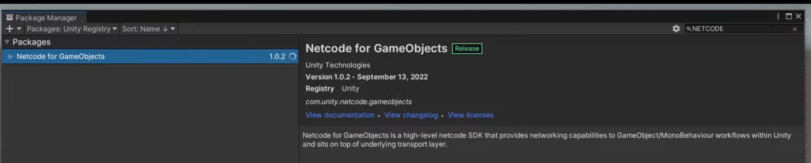

- 非必要插件 parrel Sync Link 

  https://github.com/VeriorPies/ParrelSync?path=%2FParrelSync

  用于在本地创建一个当前工程的克隆对象，且创建一次过后，拥有类似git 那样的同步功能，在主工程里修改好内容并保存以后，只要从 unity 窗口上打开 克隆工程，即可得到和主工程完全一样的克隆体，相应的，克隆体也会占用同样大小的空间，这里主要是为了调试 网络功能而使用，和游戏核心玩法无关，而且插件无法直接通过 URL的方式从unity 上下载，只能从github 上下载zip 文件后，解压，在用unity 打开文件的json 文件，手动导入，其结果就是，克隆工程在第一次打开的时候无法读出这里的 插件，只能手动把带有插件的文件夹复制过去，这里因为我的项目做了GIthub ，所以插件是直接保存在项目文件里的

  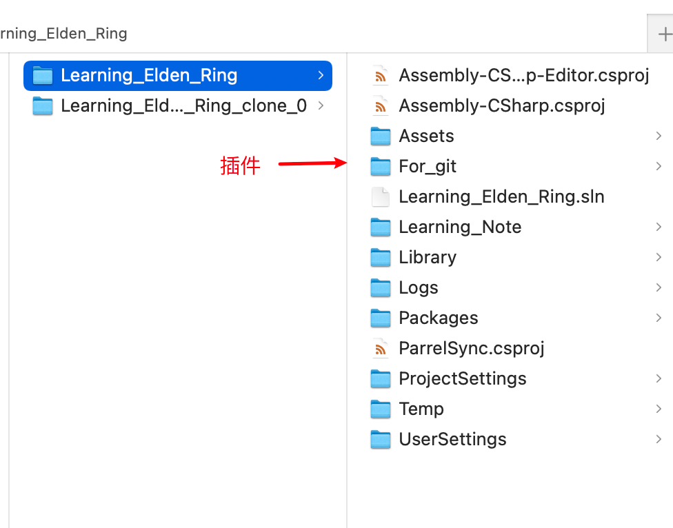


- 全部插件 EP-3

  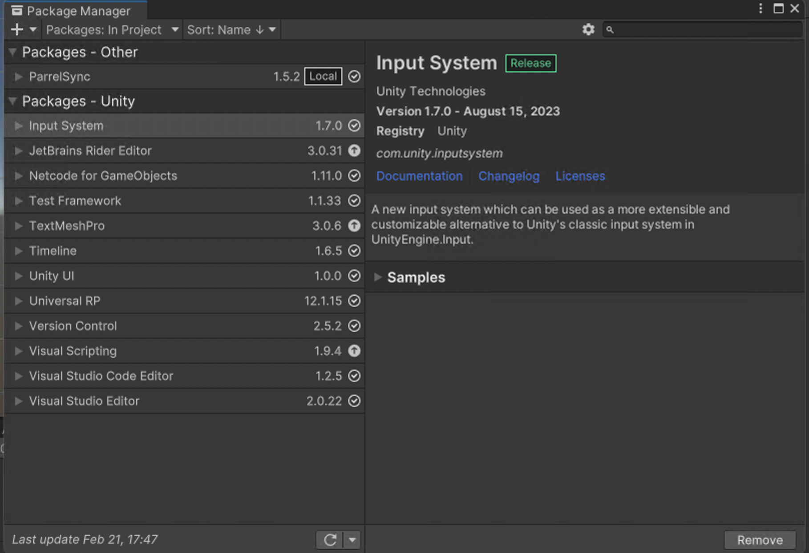

## 2、开发环境

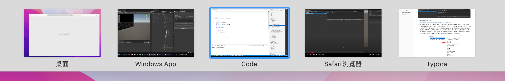

mac 远程连接 windows 电脑操控unity 编辑器，本地vscode ssh 连接 管理 windows 主机的 代码，unity 设置了手动刷新，vscode 中更改完代码后 需要 ctrl + r 来刷新，在mac 本地播放教程，做markdown 笔记


## 3、unity 场景 与 net work 配置 

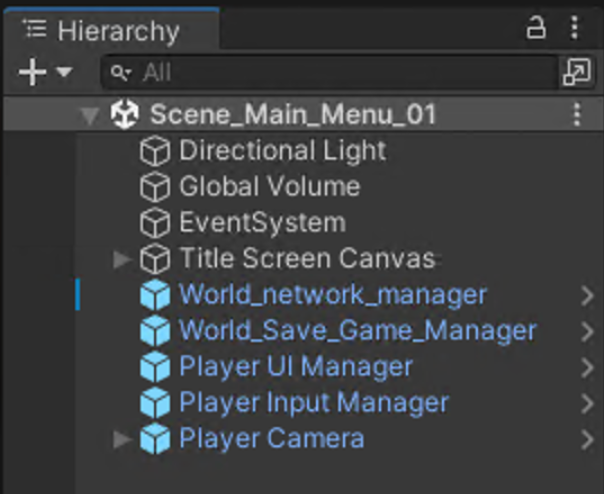

该教程和之前的 farming rpg 不同， 需要真正的场景切换，因此 这上面一些manaer 对象 都配置了 dontdestory ，此外也大都配置成了预制体，


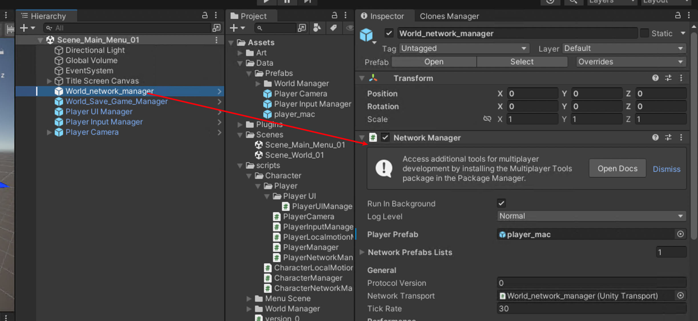

其中，world network manager 负责管理 网络相关的内容，该代码有上面的 network 插件提供，这部分到目前(25.2.21)为止暂时是一个黑盒子,还没有去看其实现原理。


PlayerUiManager 在 update 中 实现 客户端 和 服务端 的接入操作

```c#
private void Update()
        {
            if(startGameAsClient)
            {
                startGameAsClient = false;
                //为了作为客户端接入服务器，这里需要先关闭 （玩家端）的网络主机
                NetworkManager.Singleton.Shutdown();
                //之后再作为客户端 打开 
                NetworkManager.Singleton.StartClient();
            }

        }
```


克隆项目开启后，点击两次这里的 Start Game As Client 即可作为客户端 接入 主项目（服务器）

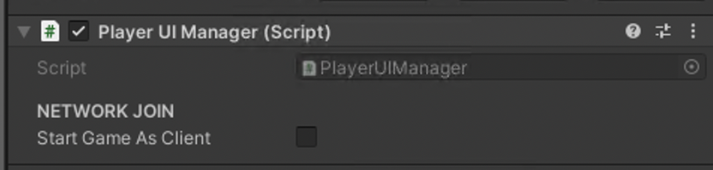


World Save Game Manager 主要负责实现场景切换，没有什么重要的内容 

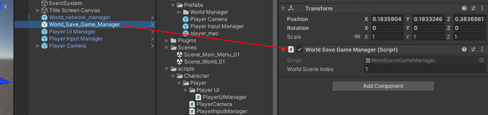


开始场景 的UI 界面设置很简单，主要就是 一个开始按钮和一个 进入 按钮 ，开始按钮上挂载的脚本会激活进入按钮，然后再把自己失活，同时也开启服务器连接，并创建一个 窗口中看不见的 player 


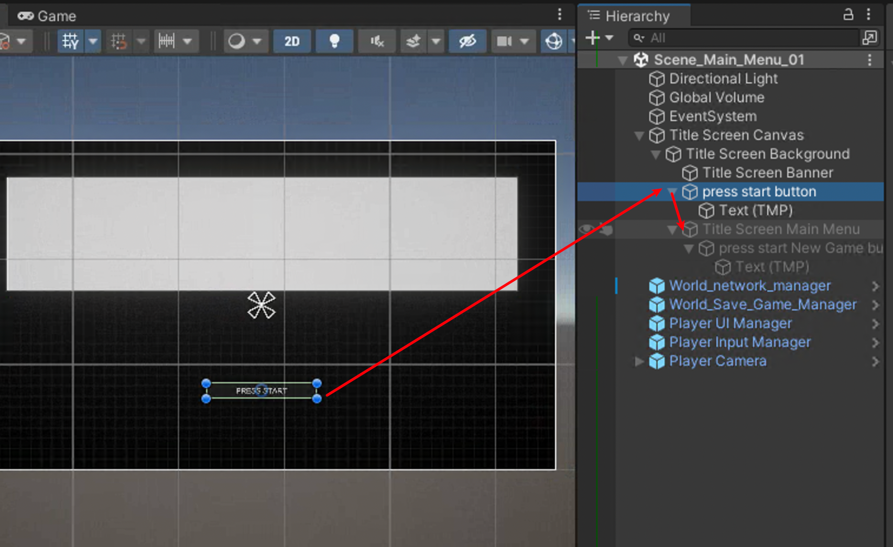

这些地方直接看源代码即可，没有什么特别值得记录的

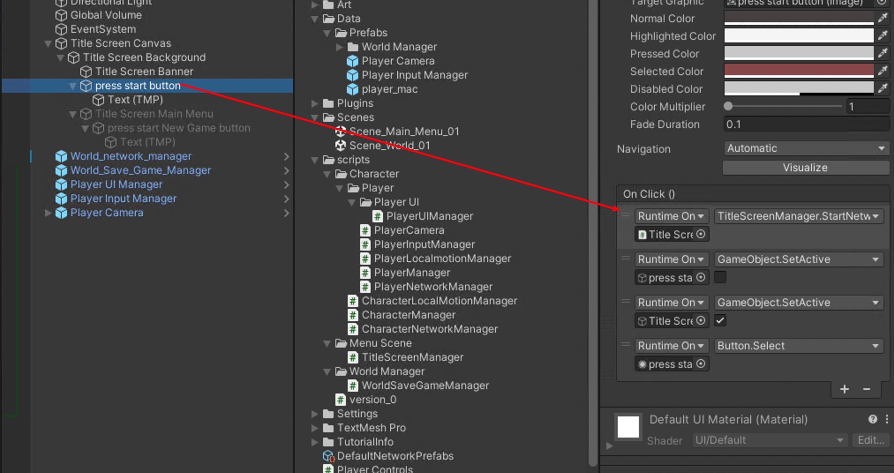


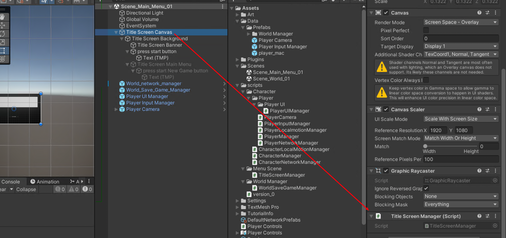


```c#
 public class TitleScreenManager : MonoBehaviour
    {
        public void StartNetworkAsHost()
        {
            Debug.Log("Start Host!"); 
          // 开机后创建 player 
            NetworkManager.Singleton.StartHost();
        }

        public void StartNewGame()
        {
          // 这里 场景切换 由 WorldSaveGameManager 的 LoadNewGame 携程实现
          // 该携程 由 TitleScreenManager 调用
            StartCoroutine(WorldSaveGameManager.instance.LoadNewGame());
        }
    } 
```

当然这些函数都不是有 脚本实现的，而是挂在道 UGUI 的 button 上， 由UGUI 来显示


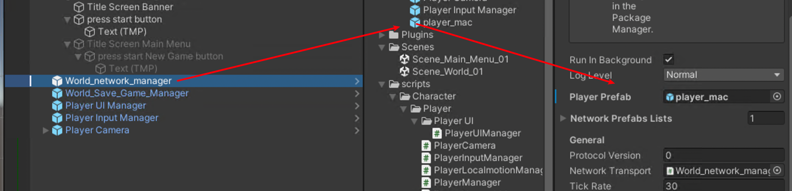

其中，player 上 由 插件的 netcode 创建的，player 不直接放置在场景上 ， 点击开始按钮后，服务器开机，创建player 


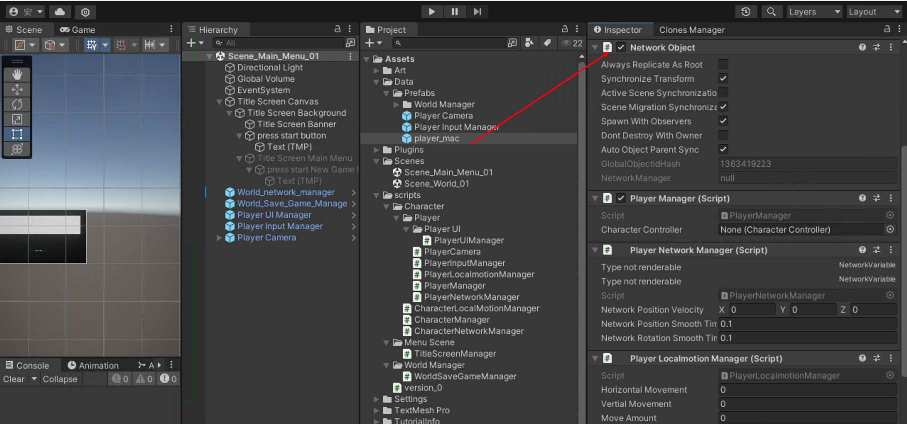


## 4、具体 代码 

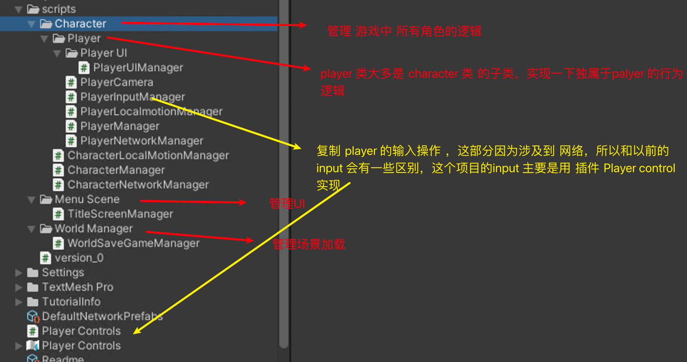

玩家输入逻辑主要靠 InputManager 插件来实现


主要负责玩家控制的 是 PlayerManager 


```c#
public class PlayerManager : CharacterManager
{
  			// PlayerLocalmotionManager 负责 玩家移动
        PlayerLocalmotionManager playerLocalmotionManager;
        protected override void Awake()
        {
            base.Awake();
            //只有玩家会做 普通 character 不会做的事
            playerLocalmotionManager = GetComponent<PlayerLocalmotionManager>();
        }

        protected override void Update()
        {
            base.Update();

            //如果当前对象不属于本机,就不要对他更新移动 
            if(!IsOwner)
                return;

            playerLocalmotionManager.HandleAllMovement();
        }
}
```


```c#
// PlayerLocalmotionManager.cs    
private void GetVerticalAndHorizontalInputs()
    {
  			// 通过 PlayerInputManager 得到 垂直和 水平方向上的输入
        vertialMovement = PlayerInputManager.instance.vertialInput;
        horizontalMovement = PlayerInputManager.instance.horizontalInput;

        //CLAMP
    }
```


```c#
// PlayerInputManager.cs 这里是通过插件 playerControls 获取输入的 vector2 值
private void OnEnable()
    {
        if(playerControls == null)
        {
            playerControls = new PlayerControls();

            //这里从 playerControls 设置好在内容中 读取输入的值,然后写入上面设置的变量 movement中 
            playerControls.PlayerMovement.Movement.performed += i  => movement = i.ReadValue<Vector2>();
        }
        playerControls.Enable(); 
    }
```

```c#
// PlayerInputManager.cs
private void HandMovementInput()
    {
  //得到输入的 值 movement 后，还要对输入的向量做一下处理，从而保证角色 x y 和 45度方向上的速度一致
        vertialInput = movement.y;
        horizontalInput = movement.x;
        // 但 上下键和 左右键 同时按下时,通过 clamp01 , 将两者的输入值 限制在 0 到 1 上 ,避免45度方向的移动快于 x y 方向 
        moveAmount = Mathf.Clamp01(Mathf.Abs(vertialInput) + Mathf.Abs(horizontalInput));


        // 将移动 的 总量 限制在 0.5 和 1.0 两个数值上, 以此来 表示 跑 和 走 
        if(moveAmount <= 0.5 && moveAmount >0)
        {
            moveAmount = 0.5f;
        }
        else if (moveAmount > 0.5 && moveAmount <=1 )
        {
            moveAmount = 1; 
        }
    }
```


```c#
//PlayerLocalmotionManager.cs

//负责具体的移动处理和旋转处理 ，这部分和其他教程里的内容差不多
private void HandleGroundMovement()
    {

        GetVerticalAndHorizontalInputs();
        //这里玩家移动的方向 将有 player camera 来 决定 
        moveDirection = PlayerCamera.instance.transform.forward * vertialMovement;
        moveDirection = moveDirection + PlayerCamera.instance.transform.right * horizontalMovement;
        //这里 direction 只是 方向, 所以需要进行归一化 
        moveDirection.Normalize();
        //unity y 方向 表示 垂直于 "地面"的向上 , 所以这里 y 方向 需要归零 
        moveDirection.y = 0;

        if(PlayerInputManager.instance.moveAmount > 0.5f  )
        {
            // 跑步 
            player.characterController.Move(moveDirection * runningSpeed * Time.deltaTime);
        }
        else if (PlayerInputManager.instance.moveAmount <= 0.5f  )
        {
            // 走 
            player.characterController.Move(moveDirection * walkingSpeed * Time.deltaTime);

        }
    }

    private void HandleRotation()
    {
        targetRotationDirection = Vector3.zero;
        targetRotationDirection = PlayerCamera.instance.cameraObject.transform.forward * vertialMovement;
        targetRotationDirection = targetRotationDirection + PlayerCamera.instance.cameraObject.transform.right * horizontalMovement;
        targetRotationDirection.Normalize();
        targetRotationDirection.y = 0; 

        if(targetRotationDirection == Vector3.zero )
        {
            targetRotationDirection = transform.forward;
        }

        Quaternion newRotation = Quaternion.LookRotation(targetRotationDirection);
        Quaternion targetRotation = Quaternion.Slerp(transform.rotation , newRotation , rotationSpeed * Time.deltaTime);
        transform.rotation =  targetRotation; 
    }
```


## 5、网络同步 


CharacterNetworkManager 管理各种和网络联机相关的参数

```c#
    public class CharacterNetworkManager : NetworkBehaviour 
      // 这里network behaviour 依然有 monbehavirour 的属性,只是多了很多和 network 相关的 内容 
    {
        //配置 position 的 网络参数, 所有对象都能访问,但只有拥有者才能写入 
        [Header("Position")]
        public NetworkVariable<Vector3> networkPosition = new NetworkVariable<Vector3>(Vector3.zero,NetworkVariableReadPermission.Everyone , NetworkVariableWritePermission.Owner);
        
        // 同步旋转 参数 

        public NetworkVariable<Quaternion> networkRotation = new NetworkVariable<Quaternion>(Quaternion.identity,NetworkVariableReadPermission.Everyone , NetworkVariableWritePermission.Owner);

        
        public Vector3 networkPositionVelocity;
        //public Quaternion networkRotationVelocity;

        public float networkPositionSmoothTime  = 0.1f;
        public float networkRotationSmoothTime  = 0.1f;
    }
```


CharacterManager 需要继承 NetworkBehaviour，而 player manager 继承自 character Manager ，

获得 了 characterNetworkManager ， 要根据 当前对象是否属于本机「if (IsOwner)」 来决定，本机在player 的

移动方面的输入是否要作用于这个对象（player 和 其他 character 都会有这个属性）

```c#
public class CharacterManager : NetworkBehaviour
    {

        public CharacterController characterController;

        CharacterNetworkManager characterNetworkManager;
        protected virtual void Awake()
        {
            DontDestroyOnLoad(gameObject);
            characterController = GetComponent<CharacterController>();
            characterNetworkManager  = GetComponent<CharacterNetworkManager>();
        }

        protected virtual void Update()
        {
            if (IsOwner)
            {
                // 如果是该对象的主机 ,那么该对象 的位置 就应该和主机位置同步 
                characterNetworkManager.networkPosition.Value = transform.position;
                characterNetworkManager.networkRotation.Value = transform.rotation;
            }

            else
            {
                //如果对象不属于该主机,就用他的网络数据 平滑后 赋值给该主机 以显示其他玩家 

                //position
                transform.position = Vector3.SmoothDamp(transform.position , 
                                                        characterNetworkManager.networkPosition.Value , 
                                                        ref characterNetworkManager.networkPositionVelocity,
                                                        characterNetworkManager.networkPositionSmoothTime);

                //rotation 
                transform.rotation = Quaternion.Slerp(transform.rotation , 
                                                        characterNetworkManager.networkRotation.Value , 
                                                        characterNetworkManager.networkRotationSmoothTime);
            }
        }


    }
```

